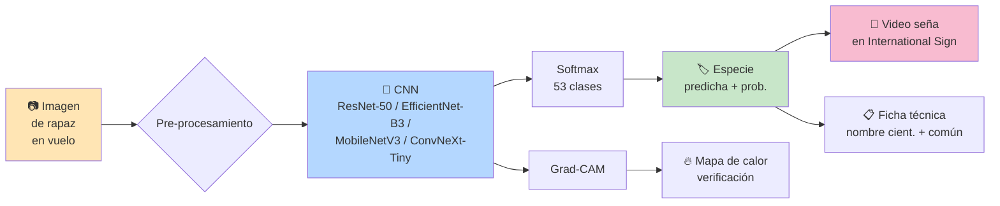

<div align="center">

# 🦅 raptors-cnn

### Sistema de Identificación de Aves Rapaces por Silueta y Comportamiento de Vuelo Utilizando IA y Diseño de Lenguaje de Señas para su Comunicación y Reconocimiento

*Tesis de Maestría — Brian Fernández Báez — 2026*

*V1.1 — 53 especies de rapaces diurnas de México. El sistema combina visión por computadora sobre **silueta en vuelo** + análisis de **comportamiento (planeo, hovering, kettle, stoop)** + catálogo de señas en International Sign para inclusión de la comunidad sorda.*

[](LICENSE)
[](https://www.python.org/downloads/)
[](https://pytorch.org/)
[](https://www.tensorflow.org/)
[](https://developer.nvidia.com/cuda-toolkit)
[](https://github.com/psf/black)
[](https://conventionalcommits.org)

</div>

---

## 📑 Abstract (English)

This thesis develops a **Raptor Identification System based on Silhouette and Flight-Behaviour Analysis using AI**, combined with Sign Language design for inclusive scientific communication. The system (1) uses a convolutional neural network (CNN) trained on the **silhouette in flight** of **53 diurnal raptor species of Mexico** (all Cathartidae, Pandionidae, Accipitridae and Falconidae documented nationally), and complements it with **flight-behaviour analysis** (soaring, flap-glide, hovering, kettle, stoop) extracted from short videos to refine identification of confusable taxa; (2) it includes a catalogue of **53 signs in International Sign (IS)** that makes ornithological knowledge accessible to the Deaf community. The project compares four state-of-the-art architectures (ResNet-50, EfficientNet-B3, MobileNetV3-Large, ConvNeXt-Tiny) implemented in both PyTorch and TensorFlow, applies Grad-CAM for interpretability validation, and follows Universal Design for Learning principles to ensure inclusive scientific communication. Code, weights and sign catalogue are released under open licenses (MIT, CC-BY).

## 📜 Resumen (Español)

Esta tesis desarrolla un **Sistema de Identificación de Aves Rapaces por Silueta y Comportamiento de Vuelo** mediante inteligencia artificial, combinado con diseño de lenguaje de señas para comunicación científica inclusiva. El sistema (1) emplea una **red neuronal convolucional** entrenada sobre la **silueta en vuelo** de **53 especies de rapaces diurnas de México** (todas las Cathartidae, Pandionidae, Accipitridae y Falconidae documentadas a nivel nacional), y la complementa con **análisis del comportamiento de vuelo** (planeo, flap-glide, hovering, kettle, stoop) extraído de videos cortos para resolver pares confusos; (2) incluye un **catálogo de 53 señas en International Sign (IS)** que hace accesible el conocimiento ornitológico a la comunidad sorda. El proyecto compara cuatro arquitecturas estado-del-arte (ResNet-50, EfficientNet-B3, MobileNetV3-Large, ConvNeXt-Tiny) implementadas en PyTorch y TensorFlow, aplica Grad-CAM como verificación de interpretabilidad, y sigue los principios del Diseño Universal para el Aprendizaje (DUA/UDL) para garantizar comunicación científica inclusiva. El código, pesos y catálogo de señas se liberan bajo licencias abiertas (MIT, CC-BY).

---

## 🎯 Características clave

- 🧠 **Modelo CNN**: 4 arquitecturas comparadas (ResNet-50, EfficientNet-B3, MobileNetV3-Large, ConvNeXt-Tiny).
- 🔄 **Dual framework**: implementación espejo en **PyTorch** y **TensorFlow** para análisis comparativo.
- 🎨 **Transfer learning** en dos etapas: feature extraction + fine-tuning con augmentation rica.
- 🔍 **Explicabilidad**: Grad-CAM verifica que el modelo atienda a los caracteres morfológicos correctos.
- 🤟 **Inclusión**: catálogo de **53 señas en International Sign** co-creado con la comunidad sorda.
- 📊 **Reproducibilidad**: seeds fijos, paths relativos, environment.yml para conda, license tracking por imagen.
- 📑 **5 capítulos de tesis** en formato DOCX, listos para entrega académica.

---

## 🗺️ Pipeline del sistema



> Diagrama completo de arquitectura, flujo de usuaria sorda y estrategia de entrenamiento: [`documentacion/diagramas/arquitectura.md`](documentacion/diagramas/arquitectura.md).

---

## 🦅 Las 53 especies objetivo — todas las rapaces diurnas de México

> El sistema reconoce **53 especies** organizadas en 4 familias (Cathartidae, Pandionidae, Accipitridae y Falconidae) según la taxonomía **AOS 2024**. La lista completa, con estatus IUCN y NOM-059, está en [`documentacion/LISTA_OFICIAL_RAPACES_MEXICO.md`](documentacion/LISTA_OFICIAL_RAPACES_MEXICO.md).

### Por familia (resumen)

| Familia | Especies | Ejemplos representativos |
|---------|---------:|--------------------------|
| Cathartidae | 4 | *Cathartes aura*, *Coragyps atratus*, *Sarcoramphus papa*, *Cathartes burrovianus* |
| Pandionidae | 1 | *Pandion haliaetus* |
| Accipitridae | 38 | *Buteo platypterus*, *B. swainsoni*, *Harpia harpyja*, *Aquila chrysaetos*, *Spizaetus ornatus*, *Astur cooperii*, *Geranospiza caerulescens*… |
| Falconidae | 10 | *Falco peregrinus*, *F. femoralis*, *F. rufigularis*, *Caracara plancus*, *Micrastur semitorquatus*, *Daptrius americanus*… |
| **TOTAL** | **53** | — |

### Cobertura geográfica

- **Migratorias del corredor de Veracruz** (núcleo histórico de V1): *Buteo platypterus*, *B. swainsoni*, *Accipiter striatus*, *Astur cooperii*, *Falco peregrinus*, etc. — pico septiembre-octubre.
- **Residentes templadas** del norte y altiplano: *Aquila chrysaetos*, *Buteo regalis*, *Parabuteo unicinctus*, *Falco femoralis*.
- **Residentes tropicales** del sureste: *Harpia harpyja*, *Spizaetus* spp., *Buteogallus* spp., *Harpagus bidentatus*, *Pseudastur albicollis*, *Daptrius americanus*.
- **Especialistas** de humedales y costas: *Rostrhamus sociabilis*, *Busarellus nigricollis*, *Pandion haliaetus*, *Haliaeetus leucocephalus*.

> **Reclasificaciones AOS aplicadas** ⚠️ (64th–65th Supplements):
> `Accipiter cooperii` → `Astur cooperii` · `Accipiter gentilis` → `Astur atricapillus` (American Goshawk) · `Buteo nitidus` → `Buteo plagiatus`

---

## 📂 Estructura del repositorio

```
raptors-cnn/
├── README.md                      ← este archivo
├── SETUP.md                       ← guía de instalación paso a paso
├── LICENSE                        ← MIT
├── CITATION.cff                   ← cómo citar el proyecto
├── CONTRIBUTING.md                ← cómo colaborar
├── .gitignore                     ← qué NO se versiona
│
├── codigo/
│   ├── pytorch/                   ← implementación principal (PyTorch + CUDA)
│   ├── tensorflow/                ← implementación espejo (TensorFlow + CUDA)
│   └── comparacion/               ← scripts y figuras de la comparativa
│
├── datos/                         ← (vacío en repo, llenado localmente)
│   ├── raw/                       ← imágenes originales
│   ├── processed/                 ← train/val/test
│   ├── annotations/               ← metadatos CSV
│   ├── README.md                  ← estructura esperada
│   └── FUENTES_DE_IMAGENES.md     ← iNaturalist, Macaulay, Pronatura
│
├── documentacion/
│   ├── tesis/                     ← Capítulos 1-5 en DOCX
│   └── diagramas/                 ← Mermaid del sistema
│
├── lengua_de_senas/
│   ├── catalogo_senas/            ← catálogo de 23 señas (propuesta del autor)
│   ├── glosario_IS_LSM.md         ← equivalencias entre lenguas de señas
│   ├── instrumentos_validacion/   ← cuestionario Likert
│   └── videos/                    ← grabaciones de las señas (pendiente)
│
└── referencias/                   ← bibliografía consolidada + plantillas
```

---

## ⚡ Inicio rápido

### Requisitos previos

- **Windows 10/11**, macOS o Linux
- **NVIDIA GPU** con drivers ≥ 535 (para CUDA 12.1)
- **Anaconda** o **Miniconda**
- **Git**

### Instalación (resumida)

```bash
# 1. Clonar el repositorio
git clone https://github.com/ZOMBIECRAFTIAN/raptors-cnn.git
cd raptors-cnn

# 2. Crear el entorno PyTorch
conda env create -f codigo/pytorch/environment.yml
conda activate raptors-pt

# 3. Instalar dependencias pip (desde ruta corta para evitar bug MAX_PATH en Windows)
cd C:\Users\<tu_usuario>
pip install -r <ruta_al_repo>/codigo/pytorch/pip-requirements.txt
cd <ruta_al_repo>/codigo/pytorch

# 4. Verificar
python verify_setup.py
```

> Guía completa paso a paso con troubleshooting en [`SETUP.md`](SETUP.md).

### Smoke-test (verifica que todo corre, sin necesidad de dataset real)

```bash
python make_synthetic_dataset.py        # crea ~980 imágenes sintéticas
python train.py --arch resnet50 --smoke-test
python evaluate.py --arch resnet50 --weights outputs/checkpoints/best_stage2.pt
python gradcam.py --image ../../datos/processed/test/Buteo_platypterus/BW_test_0000.jpg \
                  --arch resnet50 --weights outputs/checkpoints/best_stage2.pt
```

### Descargar dataset real desde iNaturalist

```bash
python download_inaturalist.py --target 250 --max-pages 5
# Descarga hasta 250 imágenes × 23 especies con licencia CC abierta
```

---

## 📖 Documentación de la tesis

Los 5 capítulos en formato DOCX (listos para revisión académica):

| Capítulo | Archivo | Tamaño |
|----------|---------|--------|
| 1 — Introducción | [`Capitulo1_Introduccion.docx`](documentacion/tesis/Capitulo1_Introduccion.docx) | ~22 KB |
| 2 — Marco Teórico | [`Capitulo2_MarcoTeorico.docx`](documentacion/tesis/Capitulo2_MarcoTeorico.docx) | ~27 KB |
| 3 — Metodología | [`Capitulo3_Metodologia.docx`](documentacion/tesis/Capitulo3_Metodologia.docx) | ~23 KB |
| 4 — Resultados (estructura) | [`Capitulo4_Resultados.docx`](documentacion/tesis/Capitulo4_Resultados.docx) | ~15 KB |
| 5 — Conclusiones (estructura) | [`Capitulo5_Conclusiones.docx`](documentacion/tesis/Capitulo5_Conclusiones.docx) | ~14 KB |

---

## 🔍 Hallazgo destacado durante la fase de verificación

Durante el smoke-test con dataset sintético, **Grad-CAM detectó shortcut learning**: el modelo alcanzó 100% accuracy aprendiendo a leer el texto de las etiquetas burned-in, no las formas geométricas que las representaban. Esto valida empíricamente la importancia de la **interpretabilidad como criterio de validación** incluso cuando las métricas son perfectas — discusión detallada en el Capítulo 4.5 de la tesis.

---

## 🤝 Contribuir

Las contribuciones son bienvenidas — imágenes con licencia abierta, mejoras al código, traducciones del catálogo de señas a otras lenguas de señas, etc. Ver [`CONTRIBUTING.md`](CONTRIBUTING.md).

## 📄 Licencia y citación

- **Código**: MIT (ver [`LICENSE`](LICENSE))
- **Pesos del modelo**: CC-BY 4.0 (al publicarse)
- **Catálogo de señas**: CC-BY-SA 4.0 (co-creación con comunidad sorda)
- **Capítulos de tesis**: CC-BY-NC 4.0
- **Citación académica**: ver [`CITATION.cff`](CITATION.cff) o usar el botón *"Cite this repository"* en la barra lateral de GitHub.

## 👤 Autor

**Brian Fernández Báez** — Tesis de Maestría — 2026
📧 brianferbaez@gmail.com

## 🙏 Agradecimientos

A Pronatura Veracruz por tres décadas de monitoreo del Río de Rapaces, al Hawk Mountain Sanctuary por compartir su metodología, al Cornell Lab of Ornithology por BirdNET y la Macaulay Library, y especialmente a los miembros de la comunidad sorda que aportan su conocimiento lingüístico para la co-creación de las señas.

---

<div align="center">

*"Si los entregables de esta tesis llegan a manos de un solo joven sordo apasionado por las aves
y le permiten nombrar, por primera vez, en su lengua, al ave que vuela sobre su cabeza,
el proyecto habrá cumplido su propósito profundo."*

— Reflexión final, Capítulo 5

</div>
