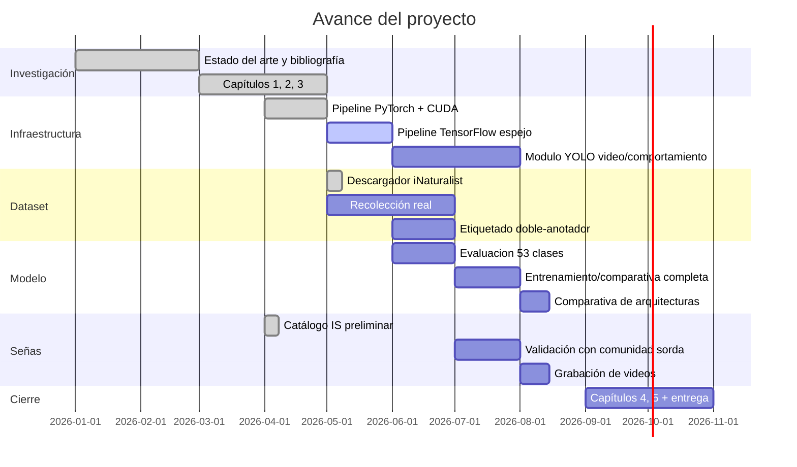

# Resumen Ejecutivo — raptors-cnn

> Hoja de una página para presentar el proyecto a tus compañeros, asesor o comité en menos de 3 minutos de lectura.

---

## 🎯 ¿Qué es este proyecto?

Un sistema de **inteligencia artificial** que identifica automáticamente las **53 especies de rapaces diurnas de México**, con énfasis en observaciones en vuelo, silueta y comportamiento. Incluye además un **catálogo de señas en International Sign** como entregable secundario de accesibilidad.

## 🧪 ¿Por qué importa?

- **México combina alta diversidad de rapaces y corredores migratorios clave**, incluido Veracruz River of Raptors, con más de 5 millones de individuos por temporada.
- **El monitoreo actual depende totalmente de expertos humanos**, con sesgo inter-observador y costo logístico alto.
- **Las personas sordas están sistemáticamente excluidas** del discurso ornitológico: no existen señas formalizadas para la mayoría de las rapaces.
- Este proyecto **atiende el problema técnico de identificación y abre una línea de inclusión científica**.

## 🛠️ ¿Cómo lo hacemos?

| Componente | Tecnología | Estado |
|------------|-----------|--------|
| Identificación visual | CNN (ResNet-50, EfficientNet-B3, MobileNetV3, ConvNeXt-Tiny) + transfer learning | ✅ Pipeline verificado |
| Comparativa | PyTorch principal + TensorFlow espejo | 🚧 En consolidación |
| Interpretabilidad | Grad-CAM | ✅ Funcionando |
| Video/comportamiento | YOLO detección/seguimiento + análisis de vuelo | 🚧 Siguiente módulo |
| Dataset | iNaturalist + Macaulay Library + eBird + CONABIO | 🚧 En curación y evaluación |
| Lengua de señas | Catálogo de 53 señas en International Sign | 🚧 Propuesta y validación pendiente |
| Validación inclusiva | Escala Likert con grupo focal sordo | 🚧 Pendiente |

## 📊 ¿Qué resultados esperamos?

- **H1**: reportar accuracy, F1 macro, top-3 accuracy, matriz de confusión y métricas por especie sobre las 53 clases.
- **H2**: Promedio Likert ≥ 4.0 / 5.0 en claridad, naturalidad y memorabilidad de cada seña.

## 🔍 Hallazgo destacado durante la verificación

Durante el smoke-test, **Grad-CAM detectó "shortcut learning"** — el modelo alcanzó 100 % accuracy aprendiendo a leer las etiquetas de texto burned-in, NO las formas geométricas que pretendían representar a las aves. Esto **valida empíricamente** la metodología de incluir interpretabilidad como criterio obligatorio: las métricas perfectas pueden estar engañando al investigador. Será una sección destacada del Capítulo 4.5 (Discusión).

## 🏗️ Estado actual del proyecto

## 🤝 ¿Cómo pueden ayudar mis compañeros?

- **Compañeros biólogos**: aportar fotografías propias, ayudar con la doble anotación y validar especies raras.
- **Compañeros de cómputo**: revisar el código, sugerir optimizaciones, ayudar con el frontend del prototipo.
- **Comunidad sorda y aliados**: participar en los talleres de co-creación y validación de señas.
- **Comité y asesor**: revisar capítulos, sugerir bibliografía, conectar con Pronatura.

## 📦 ¿Qué hay disponible hoy?

- 🌐 **Repositorio público**: `github.com/<usuario>/raptors-cnn`
- 📑 **Capítulos de tesis** conservados como material interno local
- 🧪 **Pipeline reproducible** verificado end-to-end con GPU NVIDIA
- 🎨 **Catálogo preliminar de señas** en `lengua_de_senas/catalogo_senas/`
- 📚 **Bibliografía consolidada** de 50+ referencias en APA 7.ª

---

**Contacto:** Brian Fernández Báez — brianferbaez@gmail.com
