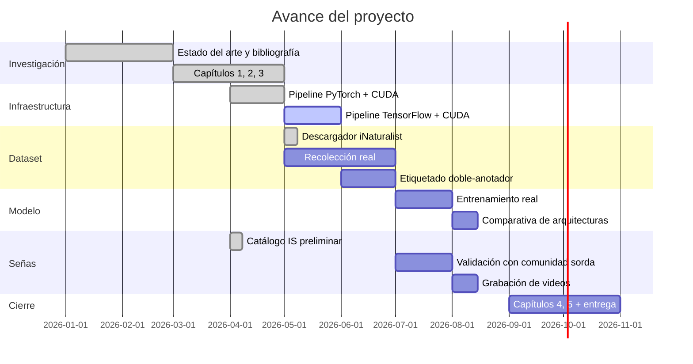

# Resumen Ejecutivo — raptors-cnn

> Hoja de una página para presentar el proyecto a tus compañeros, asesor o comité en menos de 3 minutos de lectura.

---

## 🎯 ¿Qué es este proyecto?

Un sistema de **inteligencia artificial** que identifica automáticamente **14 especies de aves rapaces migratorias** que pasan por el corredor de Veracruz, integrado con un **catálogo de señas en lengua de señas internacional (International Sign)** para hacer el conocimiento accesible a la comunidad sorda.

## 🧪 ¿Por qué importa?

- **Veracruz es el corredor migratorio de rapaces más grande del mundo:** más de 5 millones de individuos por temporada.
- **El monitoreo actual depende totalmente de expertos humanos**, con sesgo inter-observador y costo logístico alto.
- **Las personas sordas están sistemáticamente excluidas** del discurso ornitológico: no existen señas formalizadas para la mayoría de las rapaces.
- Este proyecto **atiende los dos problemas simultáneamente**.

## 🛠️ ¿Cómo lo hacemos?

| Componente | Tecnología | Estado |
|------------|-----------|--------|
| Identificación visual | CNN (ResNet-50, EfficientNet-B3, MobileNetV3, ConvNeXt-Tiny) + transfer learning | ✅ Pipeline verificado |
| Comparativa | PyTorch + TensorFlow + CUDA | ✅ Implementado |
| Interpretabilidad | Grad-CAM | ✅ Funcionando |
| Dataset | iNaturalist + Macaulay Library + propio (≥ 200 img/especie) | 🚧 En recolección |
| Lengua de señas | Catálogo de 14 señas en International Sign | ✅ Propuesta hecha por el autor |
| Validación inclusiva | Escala Likert con grupo focal sordo | 🚧 Pendiente |

## 📊 ¿Qué resultados esperamos?

- **H1**: Accuracy ≥ 85 % y F1 macro ≥ 0.83 sobre las 14 clases con dataset real.
- **H2**: Promedio Likert ≥ 4.0 / 5.0 en claridad, naturalidad y memorabilidad de cada seña.

## 🔍 Hallazgo destacado durante la verificación

Durante el smoke-test, **Grad-CAM detectó "shortcut learning"** — el modelo alcanzó 100 % accuracy aprendiendo a leer las etiquetas de texto burned-in, NO las formas geométricas que pretendían representar a las aves. Esto **valida empíricamente** la metodología de incluir interpretabilidad como criterio obligatorio: las métricas perfectas pueden estar engañando al investigador. Será una sección destacada del Capítulo 4.5 (Discusión).

## 🏗️ Estado actual del proyecto

## 🤝 ¿Cómo pueden ayudar mis compañeros?

- **Compañeros biólogos**: aportar fotografías propias del corredor, ayudar con la doble anotación.
- **Compañeros de cómputo**: revisar el código, sugerir optimizaciones, ayudar con el frontend del prototipo.
- **Comunidad sorda y aliados**: participar en los talleres de co-creación y validación de señas.
- **Comité y asesor**: revisar capítulos, sugerir bibliografía, conectar con Pronatura.

## 📦 ¿Qué hay disponible hoy?

- 🌐 **Repositorio público**: `github.com/<usuario>/raptors-cnn`
- 📑 **5 capítulos de tesis** en `documentacion/tesis/`
- 🧪 **Pipeline reproducible** verificado end-to-end con GPU NVIDIA
- 🎨 **Catálogo preliminar de 14 señas** en `lengua_de_senas/catalogo_senas/`
- 📚 **Bibliografía consolidada** de 50+ referencias en APA 7.ª

---

**Contacto:** Brian Fernández Báez — brianferbaez@gmail.com
