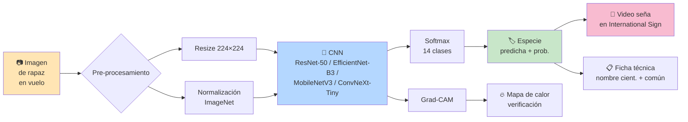
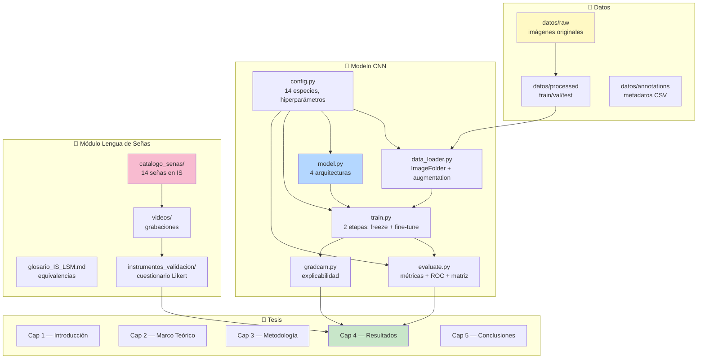
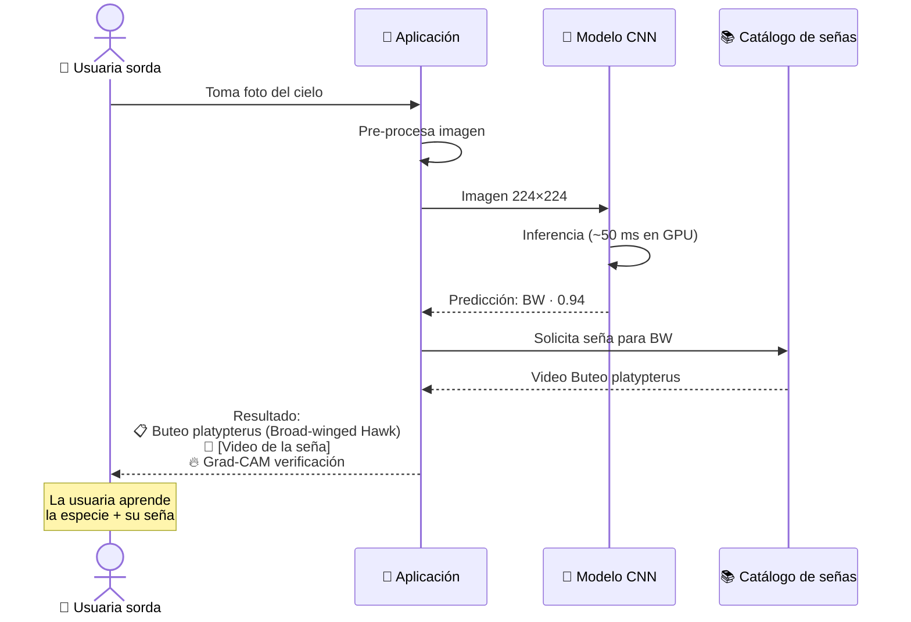
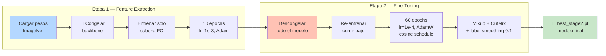
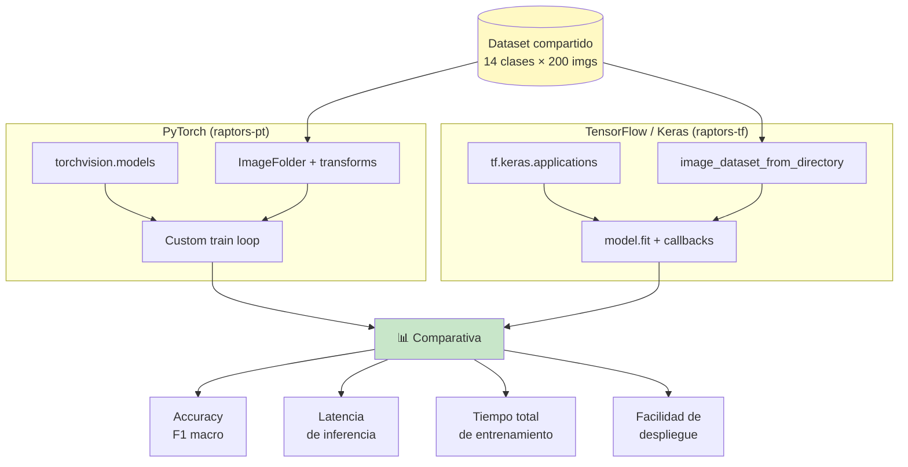

# Diagramas del Sistema

Esta página contiene los diagramas oficiales del proyecto en formato [Mermaid](https://mermaid.js.org/), que GitHub renderiza automáticamente. Sirven como insumo visual para el README, los capítulos 2-3 de la tesis y las presentaciones a compañeros y comité.

---

## 1. Pipeline completo del sistema

---

## 2. Arquitectura modular del proyecto

---

## 3. Flujo del usuario final (usuaria sorda observando aves)

---

## 4. Estrategia de entrenamiento en dos etapas

---

## 5. Comparativa PyTorch vs. TensorFlow (objetivo del OE2)

---

## 6. Las 14 especies — organización taxonómica

```mermaid
flowchart TB
    Order[Accipitriformes<br/>y Falconiformes]

    Order --> F1[Accipitridae<br/>9 especies]
    Order --> F2[Cathartidae<br/>1 especie]
    Order --> F3[Pandionidae<br/>1 especie]
    Order --> F4[Falconidae<br/>3 especies]

    F1 --> SS[SS · Accipiter striatus]
    F1 --> CH[CH · Astur cooperii]
    F1 --> ZT[ZT · Buteo albonotatus]
    F1 --> RT[RT · Buteo jamaicensis]
    F1 --> RS[RS · Buteo lineatus]
    F1 --> BW[BW · Buteo platypterus]
    F1 --> SW[SW · Buteo swainsoni]
    F1 --> NH[NH · Circus hudsonius]
    F1 --> MK[MK · Ictinia mississippiensis]

    F2 --> TV[TV · Cathartes aura]
    F3 --> OS[OS · Pandion haliaetus]
    F4 --> ML[ML · Falco columbarius]
    F4 --> PG[PG · Falco peregrinus]
    F4 --> AK[AK · Falco sparverius]

    style F1 fill:#B4D7FF
    style F2 fill:#FFE5B4
    style F3 fill:#F8BBD0
    style F4 fill:#C8E6C9
```

---

## Uso de estos diagramas

- **Para el README de GitHub**: copiar bloques selectos a la portada del proyecto (GitHub los renderiza automáticamente).
- **Para los capítulos de la tesis**: exportar a PNG con la CLI de Mermaid (`mmdc -i arquitectura.md -o diagrama.png`) o capturas desde mermaid.live.
- **Para presentación a compañeros**: usar el diagrama #1 (pipeline) y #3 (flujo de usuaria sorda) — son los más narrativos y de mayor impacto visual.
